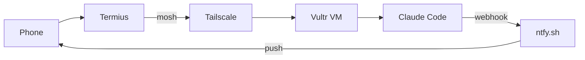
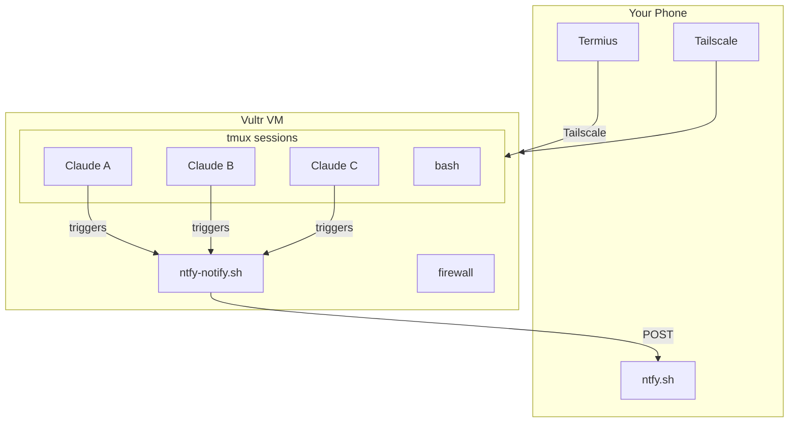

# Claude Code Mobile

Run Claude Code agents from your phone. No laptop required.



## What This Does

- **Pay-per-use VM**: ~$0.29/hr, stopped when not in use
- **Secure access**: Tailscale VPN only, no public SSH
- **Resilient connection**: mosh survives network changes
- **Push notifications**: Get notified when Claude needs input
- **Parallel development**: Run 6+ agents on different features

## Quick Start

### 1. Create a Vultr VM

1. Sign up at [vultr.com](https://www.vultr.com/)
2. Deploy a new instance:
   - Type: Cloud Compute (High Frequency)
   - Plan: `vhf-8c-32gb` (~$0.29/hr)
   - Location: Closest to you
   - OS: Ubuntu 24.04
3. Note your instance ID from the dashboard URL

### 2. Bootstrap the VM

SSH into your new VM and run:

```bash
# As root
curl -sSL https://raw.githubusercontent.com/YOUR_USER/claude-code-mobile/main/scripts/vm-bootstrap | bash
```

This installs everything: Tailscale, mosh, tmux, Node.js, Claude Code, and hardens security.

### 3. Connect Tailscale

On the VM:
```bash
tailscale up
```

Follow the auth URL. Note your Tailscale IP:
```bash
tailscale ip -4
```

### 4. Configure Your Local Machine

```bash
# Create config directory
mkdir -p ~/.config/claude-mobile

# Copy and edit config
cp config/config.example ~/.config/claude-mobile/config
# Edit with your values: VULTR_API_KEY, VULTR_INSTANCE_ID, TAILSCALE_IP, etc.

# Install scripts
cp scripts/vm-* /usr/local/bin/
chmod +x /usr/local/bin/vm-*
```

### 5. Set Up Push Notifications

1. Install the ntfy app on your phone ([iOS](https://apps.apple.com/app/ntfy/id1625396347) / [Android](https://play.google.com/store/apps/details?id=io.heckel.ntfy))
2. Subscribe to a unique topic (e.g., `claude-code-yourname-abc123`)
3. On the VM, run the setup script:

```bash
# Clone this repo
git clone https://github.com/victoremnm/claude-code-mobile.git
cd claude-code-mobile

# One-command setup (replace with your topic name)
./scripts/setup-hooks your-unique-topic-name
```

This installs the hook, creates the config, and sends a test notification.

### 6. Connect From Your Phone

1. Install [Termius](https://termius.com) on iOS/Android
2. Install [Tailscale](https://tailscale.com/download) on your phone
3. Connect:

```bash
vm-start  # Start VM and connect
```

## Usage

### Starting Your Day

```bash
vm-start        # Start VM, wait for Tailscale, connect via mosh
```

### Running Claude

```bash
cd ~/Code/myproject
claude          # Start Claude Code

# Or continue a session
claude --continue
claude --resume
```

### Parallel Development with Worktrees

```bash
# Create worktree for a feature
cd ~/Code/myproject
gwf sidebar     # Creates ../myproject-sidebar with new branch

# Each worktree gets deterministic ports
cd ~/Code/myproject-sidebar
port-alloc web  # Returns consistent port based on branch name
```

### Multiple Agents in tmux

```bash
C-a c           # New window
C-a n           # Next window
C-a p           # Previous window
C-a 1-9         # Jump to window
```

### Ending Your Day

```bash
vm-stop         # Halt VM, stop billing
```

### PR Notifications

Get notified on your phone when a PR is ready for review:

```bash
# After creating a PR
pr-notify https://github.com/user/repo/pull/123

# Or from the branch with an open PR
pr-notify
```

## Architecture



## Files

```
claude-code-mobile/
├── scripts/
│   ├── vm-start          # Start VM and connect
│   ├── vm-stop           # Stop VM to save costs
│   ├── vm-status         # Check VM status
│   ├── vm-bootstrap      # Set up fresh VM
│   ├── setup-hooks       # One-command notification setup
│   ├── pr-notify         # Send notification for PR reviews
│   └── port-alloc        # Deterministic port allocation
├── hooks/
│   └── ntfy-notify.sh    # Push notification hook
├── config/
│   ├── config.example    # Configuration template
│   ├── claude-settings.json  # Claude Code hook config
│   ├── tmux.conf         # tmux configuration
│   └── zshrc-additions.sh    # Shell aliases
├── tests/
│   ├── run-tests.sh          # Run all tests
│   ├── test-ntfy-notify.sh   # Unit tests for notification hook
│   ├── test-pr-notify.sh     # Unit tests for PR notifications
│   ├── test-mermaid.sh       # Validate Mermaid diagram syntax
│   └── test-setup-hooks.sh   # Integration tests for setup
├── .env.example          # Environment variables template
└── docs/
    └── ios-shortcut.md   # iOS Shortcut setup guide
```

## Testing

Run the test suite to verify everything works:

```bash
./tests/run-tests.sh          # Run all tests
./tests/run-tests.sh unit     # Unit tests only
./tests/run-tests.sh integration  # Integration tests only
```

## Cost

| State | Cost |
|-------|------|
| Running | ~$0.29/hr (~$7/day) |
| Stopped | $0 |

Storage charges still apply when stopped (~$0.10/GB/month), but compute is paused.

## Security Model

- **No public SSH**: VM only accessible via Tailscale
- **Hardened SSH**: Custom port, key-only auth, fail2ban
- **Defense in depth**: Cloud firewall + nftables
- **Isolated environment**: No production access, disposable VM

## Requirements

**On your phone:**
- Termius (or any SSH app)
- Tailscale

**On the VM:**
- Ubuntu 22.04+ or Debian 12+
- 8GB+ RAM recommended for Claude Code

**Accounts needed:**
- Vultr (or similar VPS provider)
- Tailscale
- ntfy.sh (free, or self-hostable)
- Anthropic API key

## Troubleshooting

### "Connection refused" from Termius (phone)

**Most common cause: Fail2ban banned your phone's Tailscale IP**

Check on VM:
```bash
nft list ruleset | grep -A5 "addr-set-sshd"
```

If your phone's IP (100.x.x.x) is listed, unban it:
```bash
fail2ban-client set sshd unbanip 100.x.x.x
```

Prevent future bans by whitelisting Tailscale:
```bash
echo 'ignoreip = 127.0.0.1/8 ::1 100.0.0.0/8' >> /etc/fail2ban/jail.local
systemctl restart fail2ban
```

### vm-status shows "null" for all values

**Cause 1: Wrong instance ID** - should be UUID, not IP address
```bash
# Find your real instance ID
curl -s "https://api.vultr.com/v2/instances" \
  -H "Authorization: Bearer $VULTR_API_KEY" | jq '.instances[] | {id, main_ip}'
```

**Cause 2: Vultr API IP restrictions**
- Go to https://my.vultr.com/settings/#settingsapi
- Remove IP restrictions or add your current IP
- Check your IP: `curl ifconfig.me`

### "apt lock" error during bootstrap

Fresh Ubuntu VMs run auto-updates. Wait or kill:
```bash
# Wait (safer)
while fuser /var/lib/dpkg/lock-frontend >/dev/null 2>&1; do sleep 5; done

# Or kill (faster)
killall unattended-upgr apt apt-get
```

### SSH works from Mac but not phone

1. Verify Tailscale is connected on phone (check the app)
2. Ensure SSH key from Termius is in `~/.ssh/authorized_keys` on VM
3. Check fail2ban hasn't banned the phone (see above)

### mosh won't connect

- Ensure mosh is installed on VM: `apt install mosh`
- Check UDP ports 60000-61000 are open: `nft list ruleset | grep 60000`
- Try regular SSH first to isolate the issue

### "Permission denied (publickey)"

Your SSH key isn't on the VM. Add it:
```bash
# Get your public key (on Mac)
cat ~/.ssh/id_ed25519.pub

# Add to VM
echo "ssh-ed25519 AAAA..." >> ~/.ssh/authorized_keys
```

For Termius: Generate a key in Keychain, then add its public key to the VM.

### vm-start requires sudo

Fix script permissions:
```bash
sudo chmod 755 /usr/local/bin/vm-*
```

### Not receiving push notifications
- Check `NTFY_TOPIC` in config
- Test manually: `~/.claude/hooks/ntfy-notify.sh test`
- Verify hook is in `~/.claude/settings.json`
- Ensure you're subscribed to the topic in the ntfy app

### Claude Code slow
- Check VM resources: `htop`
- Consider larger VM plan (vhf-4c-16gb minimum recommended)

## Credits

Based on the mobile development workflow by [@mgranda](https://github.com/mgranda).

## License

MIT
